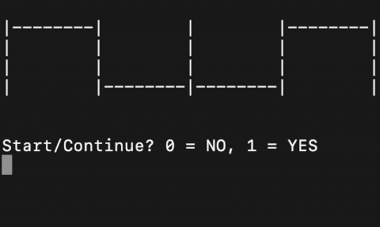

# **CLI Crankshaft + Cylinder Cycle Visualizer (Learning Project)** v0

01/12/25

This command-line program simulates a single-cylinder, 4-stroke engine cycle and displays the crankshaft and piston states using ASCII graphics.  

It was built as a **training project for embedded/automotive development**, focusing on multi-file C design, modularity, and clean separation between **engine/state machine logic** and **output/actuator-like control code**.

---
## Demo



---
## **Project Goals**

Main objectives:

### **1. Understanding multi-file structure the way real embedded projects do it**

- Splitting the codebase into a main folder with `cranklib/` and `graphics/`
- Seeing how the compiler and linker resolve relationships across many `.h` + `.c` files
- Designing a small “library-like” structure instead of dumping everything next to `main.c`  
    This is meant to mirror how automotive firmware separates subsystems into modules.

### **2. First steps toward custom, reusable libraries**

- Treating folders as small modules with their own public headers and private implementation
- Building a controlled public API (clean function prototypes, shared enums, structs)
- Preparing a structure that can later be ported to C++ classes/namespaces  

### **3. Separating state-machine logic from output handling**

This mirrors the real ECU split between:

**Virtual model / state machine**

- Crankshaft lobe position (TDC/BDC)
- High-level 4-stroke phase logic

**Actuator/output control layer**

- Terminal ASCII graphics act as a stand-in for “actuators” (valve commands, injector timing, etc.)
- The graphics layer never computes engine logic; it only reacts to it to it
- `main.c` orchestrates the flow, similar to an ECU event loop

This is meant to emulate the architectural philosophy seen in engine control modules (ignition, injection, and valve-control systems): **compute state → translate to outputs**.

### **4. Practicing a lightweight visual layer through ASCII graphics**

While primitive, the ASCII renderer trains the idea that:

- The internal model owns the truth
- A separate interface layer decides _how to present_ or _how to actuate_
- Redrawing the terminal is analogous to sending fresh commands to actuators

### **5. Strengthening debugging skills with a deterministic virtual model**

Simulating the engine cycle in the terminal provides:

- A clean visual trace
- Repeatable behavior
- A simple environment to test logic changes 

---
## **How It Works**

- The engine module updates crank/cylinder position on each cycle.
- After every 8 cycles, the program pauses and lets the user continue or stop.
- The graphics module converts the internal engine state into ASCII visuals.
- ANSI escape sequences redraw the frame to keep the output readable.

---

## File Structure

```
CLI_Sim/
│
├── main.c                  # Central loop / orchestrator
├── global.h/.c
├── checkContinue.h/.c
│
├── cranklib/               # Engine state machine (virtual model)
│   ├── cranklib.h
│   ├── initCrank.c
│   ├── spinCrank.c
│   └── Makefile
│
├── graphics/               # ASCII "actuator/output layer"
│   ├── graphicslib.h
│   ├── spinCrankVisual.c
│   ├── printers.c
│   └── Makefile
│
└── Makefile                # Simple build system

```